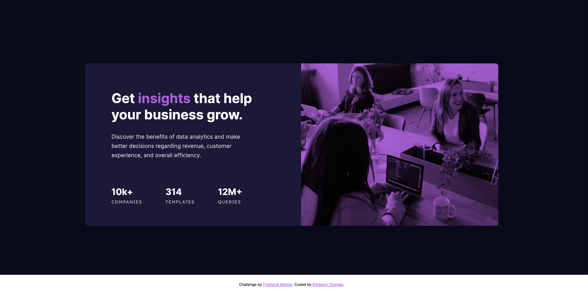

# Frontend Mentor - Stats preview card component solution

This is a solution to the [Stats preview card component challenge on Frontend Mentor](https://www.frontendmentor.io/challenges/stats-preview-card-component-8JqbgoU62). Frontend Mentor challenges help you improve your coding skills by building realistic projects. 

## Table of contents

- [Overview](#overview)
  - [The challenge](#the-challenge)
  - [Screenshot](#screenshot)
  - [Links](#links)
- [My process](#my-process)
  - [Built with](#built-with)
  - [What I learned](#what-i-learned)
  - [Continued development](#continued-development)
  - [Useful resources](#useful-resources)
- [Author](#author)

## Overview

### The challenge

Users should be able to:

- View the optimal layout depending on their device's screen size

### Screenshot



### Links

- Live Site URL: https://kimberlyannthomas.github.io/frontend-mentor-coding-challenges/stats-preview-card-component/
- Solution URL: https://www.frontendmentor.io/solutions/stats-preview-card-component-flexbox-and-responsive-images-1ZehXJ-kg

## My process

### Built with

- Semantic HTML5 markup
- CSS custom properties
- Flexbox
- Mobile-first workflow

### What I learned

This is my first-time using rem units. I found it easy to make the HTML base font size 62.5% for simpler calculations.

I figured out for the picture element that if I’m coding mobile-first, the source element for the largest screen size should appear first, otherwise the browser will select the photo meant for the smallest screen size every time regardless of the viewer’s screen size.

This is a contrast to adding media queries in the CSS where coding mobile-first means that you begin with the smallest screen size and work your towards the largest screen size.

```html
<h1>Some HTML code I'm proud of</h1>
```
```css
  <picture>
        <source srcset="images/image-header-desktop.jpg" media="(min-width: 768px)">
        <source srcset="images/image-header-mobile.jpg" media="(min-width: 327px)">
        
   </picture>
```

### Continued development

My plans for continued development improvements include mastering responsive images, stronger HTML markup, and accessibility.

### Useful resources

- [The HTML picture element explained](https://www.youtube.com/watch?v=Rik3gHT24AM) - This helped me to understand how the picture element works. 

## Author

- Frontend Mentor - [@kimberlyannthomas](https://www.frontendmentor.io/profile/kimberlyannthomas)
